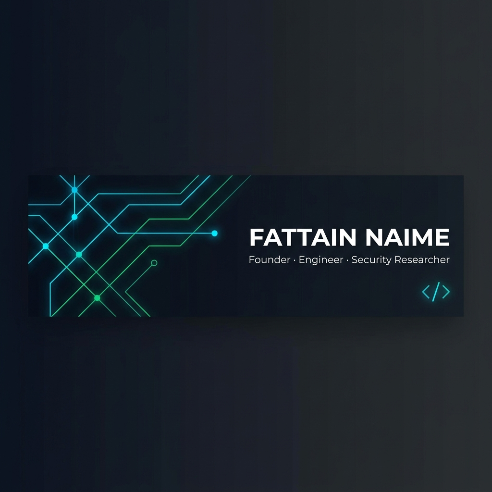

<p align="center">
  
</p>

<p align="center">
  <a href="https://iamnaime.info.bd"></a>
  <a href="https://www.linkedin.com/in/fattain-naime"></a>
  <a href="https://x.com/Fattain_Naime"></a>
  <a href="mailto:iamnaime@builderhall.com"></a>
  <a href="https://www.google.com/search?kgmid=/g/11vyy8gwxn"></a>
</p>

<p align="center">
  
</p>

---

<h1 align="center">Hey there 👋 I'm Fattain Naime</h1>

<p align="center">
  <a href="https://iamnaime.info.bd"></a>
</p>

<br />

## 🧬 About Me

I build **scalable tech ecosystems**, not just apps.

I'm the Founder & CEO of **[Builder Hall Ltd.](https://builderhall.com)**, a software development company based in Dhaka, Bangladesh — and the architect behind multiple digital ventures reshaping commerce, payments, and the freelance economy in South Asia.

With deep roots in **full-stack engineering**, **cybersecurity research**, and **product thinking**, I operate at the intersection of code, security, and business — turning complex problems into elegant, production-grade systems.

```text
🏢  Founder & CEO          →  Builder Hall Ltd.
🛡️  Security Lab           →  Lab 0x4E
💳  Currently Building     →  OwnPay — Open Source Payment Infrastructure
🌍  Based in               →  Dhaka, Bangladesh
💬  Ask me about           →  System Architecture, Laravel, Security, Startups
✍️  Blog                   →  iamnaime.info.bd
```

---

## 📈 Impact & Milestones

<p align="center">
  
  
  
  
</p>

---

## 🏗️ Ventures & Initiatives

| Venture | Description |
|---------|-------------|
| **[Builder Hall](https://builderhall.com)** · [GitHub](https://github.com/builderhall) | Full-service software company delivering custom solutions — from mobile apps to enterprise platforms |
| **[GigLovin](https://giglovin.com)** | Scam-free freelance marketplace with escrow-backed payments, built on trust & transparency |
| **[OwnPay](https://ownpay.org)** · [GitHub](https://github.com/own-pay) | Self-hosted, open-source, plugin-based payment automation platform for founders |
| **[SMS Hall](https://smshall.com)** | Bulk SMS & marketing automation platform with API/webhook integrations |
| **[Shopika](https://shopika.com.bd)** | E-commerce platform tailored for Bangladesh's digital commerce ecosystem |
| **[BASH](https://bashub.org)** | Startup ecosystem initiative focused on mentorship, networking & community building |

---

## 🛡️ Security Lab — Lab 0x4E

```
  ██▓      ▄▄▄       ▄▄▄▄      ▒█████  ▒██   ██▒ ██  ██▓▓█████ 
 ▓██▒     ▒████▄    ▓█████▄   ▒██▒  ██▒▒▒ █ █ ▒░ ██ ▓██▒▓█   ▀ 
 ▒██░     ▒██  ▀█▄  ▒██▒ ▄██  ▒██░  ██▒░░  █   ░▓██ ▒██░▒███   
 ▒██░     ░██▄▄▄▄██ ▒██░█▀    ▒██   ██░ ░ █ █ ▒ ▓▓█ ░██░▒▓█  ▄ 
 ░██████▒  ▓█   ▓██▒░▓█  ▀█▓ ░ ████▓▒░▒██▒ ▒██▒▒▒█████▓ ░▒████▒
 ░ ▒░▓  ░  ▒▒   ▓▒█░░▒▓███▀▒ ░ ▒░▒░▒░ ▒▒ ░ ░▓ ░░▒▓▒ ▒ ▒░░ ▒░ ░
```

Independent security research focused on building resilient, hardened systems.

- 🔍 **Penetration Testing** — Web apps, APIs & network infrastructure
- 🛡️ **Server Hardening** — Production-grade Linux security configurations
- 🕵️ **Vulnerability Research** — Discovering & responsibly disclosing security flaws
- 🧪 **Malware Analysis** — Reverse engineering & threat intelligence

> *"Understand how systems break — build systems that don't."*

---

## ⚡ Tech Stack

<h4 align="center">Languages</h4>
<p align="center">
  
  
  
</p>

<h4 align="center">Backend & Frameworks</h4>
<p align="center">
  
  
</p>

<h4 align="center">Frontend & Mobile</h4>
<p align="center">
  
  
</p>

<h4 align="center">Databases</h4>
<p align="center">
  
  
  
</p>

<h4 align="center">DevOps & Infrastructure</h4>
<p align="center">
  
  
  
  
</p>

---

## 🔭 Currently

```yaml
working_on: "OwnPay — Open Source Payment Infrastructure"
learning: "AI/ML integrations for SaaS platforms"
collaborating: "Open to partnerships on fintech & e-commerce projects"
fun_fact: "I break things to understand how to build them better 🔓"
```

---

## 📊 GitHub Analytics

<p align="center">
  
  
</p>

<p align="center">
  
</p>

<p align="center">
  
</p>

---

## 📦 Open Source Highlights

<table>
  <tr>
    <td>💳</td>
    <td><strong>bKash Payment Integrations</strong> — WooCommerce & Laravel plugins for bKash payment gateway</td>
  </tr>
  <tr>
    <td>📱</td>
    <td><strong>WooCommerce SMS Automation</strong> — Order notification system via SMS gateways</td>
  </tr>
  <tr>
    <td>💱</td>
    <td><strong>Currency Auto-Sync Systems</strong> — Real-time exchange rate synchronization tools</td>
  </tr>
  <tr>
    <td>⚙️</td>
    <td><strong>WordPress Custom Execution Tools</strong> — Advanced automation & task runners for WordPress</td>
  </tr>
</table>

---

## 🤝 Let's Connect

<p align="center">
  <a href="https://iamnaime.info.bd"></a>
  <a href="https://www.linkedin.com/in/fattain-naime"></a>
  <a href="https://x.com/Fattain_Naime"></a>
  <a href="https://www.facebook.com/fattain.naime"></a>
  <a href="https://www.instagram.com/fattain_naime"></a>
  <a href="https://t.me/fattainnaime"></a>
  <a href="https://discord.com/users/fattain-naime"></a>
  <a href="mailto:iamnaime@builderhall.com"></a>
</p>

<p align="center">
  <a href="https://iamnaime.info.bd"></a>
</p>

---

<p align="center">
  
</p>

<p align="center">
  <strong>Building systems that scale. Securing systems that matter.</strong>
  <br />
  <sub>💡 Open to collaboration, mentorship, and ambitious ideas — let's build something great together.</sub>
</p>
